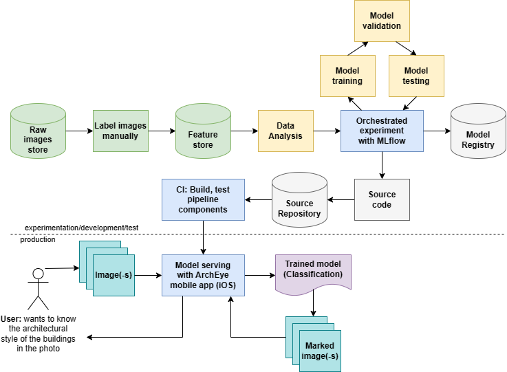

# ArchEye project

Our project is dedicated to recognizing the architectural styles of buildings from photos.

# Проект ArchEye

## Введение

Наш проект посвящён определению архитектурных стилей зданий по фотографиям.

### Характеристики решения

Итоговая модель предсказывает архитектурные стили с высокой точностью: f1-мера на тестовой части данных = 92.44 %.

В качестве метрик успеха можно рассмотреть, например, увеличение интереса среди молодого поколения к искусству, повышение качества образования в области искусства.

### Демо

## Как устроено наше решение?

Ниже можно ознакомиться с архитектурой нашего решения.

### Подход к решению задачи

В итоге мы остановились на подходе с использованием модели для решения задачи классификации. По входному изображению модель будет предсказывать его архитектурный стиль (класс).

### Классы

Поскольку наш проект нацелен на определение архитектурных стилей, вопрос классов стоит довольно остро. Было проведено исследование наиболее распространённых архитектурных стилей в России и были выделены следующие классы и подклассы:

1.	Древнерусская архитектура:
    *	Древнерусская крестово-купольная архитектура
    * Древнерусская шатровая архитектура
2.	Барокко и его вариации:
    *	Барокко
    *	Петровское барокко
    *	Елизаветинское барокко
3.	Классицизм и его вариации:
    *	Классицизм
    *	Ранний классицизм
    *	Строгий классицизм
    *	Поздний классицизм
    *	Павловский классицизм
4.	Историзм:
    *	Историзм
    *	Русский ампир
    *	Неоренессанс
    *	Необарокко
    *	Неовизантийский
5.	Модерн и его вариации:
    *	Модерн
    *	Русский модерн
6.	Современные и экспериментальные стили:
    *	Авангард
    *	Деконструктивизм
    *	Постмодерн
    *	Конструктивизм
7.	Сталинская архитектура:
    *	Сталинская неоклассика
    *	Сталинский ампир
8.	Типовая советская архитектура:
    *	Типовая архитектура хрущевского времени
    *	Типовая архитектура брежневского времени

Все результаты проведённого мини-исследования зафиксированы в Google Sheets по следующей ссылке (на странице "Стили"): https://docs.google.com/spreadsheets/d/1flZR9etKiiBj5woGevgpPm_uXmV5QDf2FaGiVF5qL9s/edit?usp=sharing.

В качестве итоговых классов были выбраны все вышеперечисленные классы, кроме историзма. Историзм было решено удалить по причине того, что этот стиль сочетает в себе элементы многих архитектурных стилей из разных исторических эпох, поэтому он может быть слишком похож на все остальные классы.

### Сбор датасета

Для сбора сырого датасета картинок использовался web-scraping для автоматического сохранения картинок из результатов поиска на сайте с архитектурной фотобазой (https://photobuildings.com/) или из выдачи обычного Google. Поисковые запросы / фильтры содержали название рассматриваемого архитектурного стиля.

Ссылка на реализованный нами scraper: https://github.com/ArchEye-Team/Scraper.

Таким образом мы собрали сырой датасет с отдельными папками для картинок каждого из 7 выделенных классов. Более подробная информация о собранном сыром датасете сохранена в нашей Google-таблице (на странице "Ресёрч по датасетам"): https://docs.google.com/spreadsheets/d/1flZR9etKiiBj5woGevgpPm_uXmV5QDf2FaGiVF5qL9s/edit?usp=sharing.

После сбора сырого датасета была дополнительно осуществлена его очистка: удаление лишних изображений внутри каждого из классов, а также дубликатов, которые попали сразу в несколько классов в сыром датасете.

Для версионирования нашего датасета мы использовали MLFlow. На текущий момент есть 2 версии датасета: сырой и после очистки.

Все требования к данным, инструкции для разметчика, а также расчёт стоимости сборки всего датасета были подробно расписаны в нашем Google-документе (https://docs.google.com/document/d/1NPxiwmb6qTcejX8FUNtnz5B4XwUiJwMTlFEK3ELzqfk/edit?usp=sharing)

### Эксперименты по обучению классификационных моделей

В качестве моделей для экспериментов мы отобрали 3 классификационных модели: EfficientNetV2, ViT и ResNet. Обоснование выбора моделей, ссылки на код для обучения зафиксированы в Google-таблице (на странице "Модели для классификации"): https://docs.google.com/spreadsheets/d/1flZR9etKiiBj5woGevgpPm_uXmV5QDf2FaGiVF5qL9s/edit#gid=2029452096.

Обучение осуществлялось на kaggle (на gpu T4), эксперименты логировались с помощью MLFlow. Для воспроизводимости наших экспериментов все random_seeds были зафиксированы. Для возможности честного сравнения экспериментов разбиения train-val-test были одинаковыми для всех экспериментов.

В качестве главной метрики качества была выбрана macro f1-мера. Сравнение экспериментов с обучением различных классификаторов осуществлялось на основе её значений.

Ниже приведена таблица с итоговыми значениями метрик качества в конце обучения выбранных классификационных моделей:

| **Модель** 	      | **f1-score on val (%)** 	 | **f1-score on test (%)** 	 |**size (pt), MB** 	 | 
|------------------------|-----------------|--------------|-----------------|
| EfficientNet 	      | 73.77	          | 74.06 	      | 204.4 	      |
| ViT          | 	 92.11        | 	   92.44    | 327.4 	      |
| ResNet    | 73.86	          | 76.44	       | 163.1 	      |

В качестве итоговой модели выбрана ViT, так как она показала самые высокие результаты на валидационной и тестовой частях датасета.

Веса обученных моделей сохранены в папке на яндекс-диске: https://disk.yandex.ru/d/O7m7Ewd9vNWJCQ.

### Приложение
